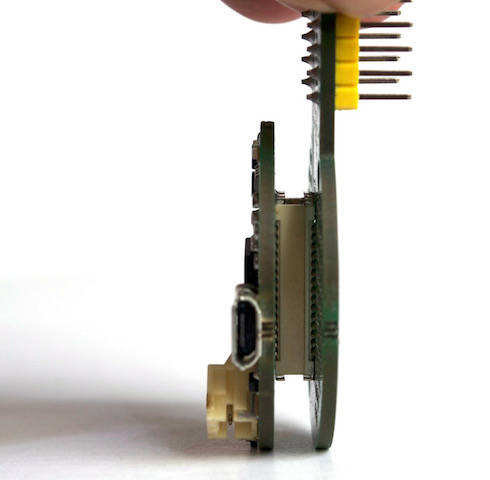

# ProtoCentral Kalam v3 IOT platform - Starter Kit
------------------
This kit includes all the basic components required to get your Kalam-based IoT project up and running.


# Kit Contents:

* 1x Kalam v3 IoT board
* 1x GPIO cap for Kalam v3 platform
* 1x 3.7V, 1200 mAH Li-Poly battery (only for orders within India)
* 1x micro-USB cable
* 1x breakaway header-20 pins

# Putting it together

ProtoCentral Kalam v3 is our newest IOT platform based on the ESP8266 Wi-Fi SoC. It's easy-to-use, low cost and easily scalable. 

The new plug-to-play feature allows you to plug-in "modules" to the basic Kalam v3 board to add more functionality such as sensors and actuators.

This documents guides you through the various steps required to put the basic blocks togther and get your first program up and running.

Step 1 - Connecting the boards
--------


Take the Kalam v3 main board and the GPIO cap provided in the kit. On the reverse side of each board, you will find a white 31-pin connector that mates with the other. Gently put it together and then press firmly to get a good fit. The connectors only go in one way, so make sure to align them properly. The connectors should align up with each other as shown in the below picture.



Step 2 - Connect the battery
-------------------

If you have purchased Kalam as a kit and you have a Li-Ion battery included, connect the battery to the white JST connector on the board as shown below. 


This connector will also go in only one way. Please note the direction in which it is to be inserted.

If you purchased the Kalam board separately and a battery was not included, you can use it with any 3.7V Li-Ion/Li-Poly battery with a JST connector. ***Ensure that the connector has the proper polarity before connecting any external battery pack.***


Step 3 - Plugging it into a breadboard (optional)
-----------------

If you have a breadboard, you can now directly plug in the entire assembly into a standard breadboard and it should now be ready for prototyping


Step 4 - Setting up Arduino for Kalam
----------------------------

Kalam is powered by the Sparkfun's board support file.The first thing you will need to do is to download the latest release of the Arduino IDE. You will need to be using version 1.6.4 or higher. 
After you have downloaded and installed v1.6.4, you will need to start the IDE and navigate to the Preferences menu.
Sparkfun's  JSON url for ESP8266 board is - https://raw.githubusercontent.com/sparkfun/Arduino_Boards/master/IDE_Board_Manager/package_sparkfun_index.json


* Click Ok to close and save the preferences
* Then click Tools > Board > Board Manager
* You should find Sparkfun ESP8266 boards listed in the Board Manager window.

 
 
*	Press the “Install” button on the chosen ESP8266 category.The download process will begin
* Reboot Arduino and look under Tools > Boards and you should see the addition of the Sparkfun boards in your board list.


Step 5 - Setting up ThingSpeak
-------------------------------
The Internet of Things (IoT) provides access to a broad range of embedded devices and web services. ThingSpeak is an IoT platform that enables you to collect, store, analyze, visualize, and act on data from sensors or actuators.The primary element of ThingSpeak activity is the channel, which contains data fields, location fields, and a status field. After you create a ThingSpeak channel, you can write data to the channel, process and view the data  and react to the data.

### Sign-up for ThingSpeak

ThingSpeak requires a user account and a channel. A channel is where you send data and where ThingSpeak stores data. Each channel has up to 8 data fields, location fields, and a status field. You can send data every 15 seconds to ThingSpeak.

* Sign up for new User Account – https://thingspeak.com/users/sign_up


* Create a new Channel by selecting Channels, My Channels, and then New Channel


You can change the name to fit your need and you can add a description corresponding to the channel. You can add any other useful description into the metadata field. In the same page, you should see the fields for Latitude, Longitude and Elevation. Also, you can make the channel as "Private" or "Public".


Once you have edited the fields, click on ‘Save Channel’ button.

### Running The skecth

* Step1: Plug-in the Kalam to the Computer throughthe micro-USB cable provided.
* Step2: Kalam board got a on board FT231 which is a USB to UART bridge for the uploading the sketch
* Step3: Your system has to automaticlly install the FTDI drivers and it shows up as a vertual COM port.  You can go to the Windows     Device Manager and look under Ports(COM & LPT) to find out the COM port number for the installed device.
###Note:If you've never used an FTDI device, you may need to install drivers on your computer before you can program the Kalam.For installation please checkout this tutorials from Sparkfun -- https://learn.sparkfun.com/tutorials/how-to-install-ftdi-drivers/windows---quick-and-easy
 


Open the Arduino IDE, load the example skecth provided
Upload the Blink:


We have provided a few Arduino sketch examples . They are designed to work right away with no changes.  To make the examples work with your ThingSpeak channel, you will need to configure the myChannelNumber and myWriteAPIKey variables.

  ```
const char* tokenid = "OFZEOKCL95S8HRNI"

  ```
Running a sketch
----------------
Load the example in the Arduino IDE. Make sure to select the board as "Sparkfun ESP8266 Thing Dev"  and COM port. Then, upload the code to your Kalam.

License Information
-------------------
This product is open source!

Please use, reuse, and modify these files as you see fit. Please maintain attribution to Protocentral and release anything derivative under the same license.
